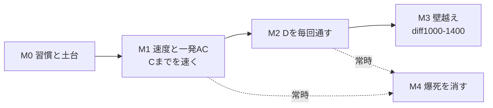

# AtCoder 攻略ロードマップ（Coji 個別最適）

> 根拠: [research/01-skill-analysis.md](research/01-skill-analysis.md)
> 前提: 精進時間 **週2〜3h** ／ 本番言語 **C++**（既存 `~/git/AtCoder` の Cpp + ac-library を使用）
> 最終目的: **AWS Jam の AI 無しコンテストに慣れる** = 時間内に速く・正確に・爆死せず捌く地力

## 基本戦略（なぜこの順番か）

分析の結論は「実力は既に 900+ 相当。停滞は ①参加減 ②C までに時間を使い D/E に届かない ③WA/爆死で下振れ、が原因」。
だから**新しい難問をたくさん解くより、既にある地力を本番で出し切る訓練**が費用対効果が高い。週2〜3h という限られた時間なら特に。

M4（爆死対策）は独立マイルストーンだが M1 以降**常時並走**する習慣。

## 週次の基本サイクル（全マイルストーン共通）

週2〜3h の配分テンプレート:
- **ABC 本番参加（約1.5h）** — 最優先。出られない週はバーチャル参加で代替。
- **本番直後の復習（30〜45分）** — 解けなかった1つ上の問題（多くは D か E）を、解説を見て自力で通し直す（upsolve）。
- **余力（〜30分）** — 詰まり見本/テーマ埋めから1問。

> 精進サイトは [AtCoder Problems](https://kenkoooo.com/atcoder/) の Recommendation / Difficulty 順を使う。

---

## M0. 習慣と土台づくり（1〜2週間）

**狙い**: 「毎回出る」を仕組み化し、C++ の初動を速くする。停滞の主因（参加減）を最初に潰す。

やること:
- [ ] **参加の常態化**: 毎週の ABC をカレンダー固定。出られない週は後日バーチャル参加すると決める。
- [ ] **C++ テンプレ整備**: 既存 `~/git/AtCoder/Cpp` に、入出力高速化・よく使うマクロ・`ac-library` の include を揃えた提出テンプレを用意し、コンテスト開始時に即コピーできる状態にする。
- [ ] **詰まり見本7問のウォームアップ**（research/01 §5）: 未 AC で放置している解けるべき問題を潰す。
  - arc024_a / arc162_a / arc164_a / arc110_b / abc400_c / abc142_d / abc408_d
- [ ] 「1問あたりの想定時間」の感覚をつかむため、直近ABCのA/B/Cをバーチャルで測ってみる。

**完了条件（KPI）**: 提出テンプレが1コマンドで出せる ／ 詰まり見本7問を全 AC ／ 次のABCに参加登録済み。

---

## M1. 速度と一発AC — 「C までを速く」（3〜5週間 / 常時継続）

**狙い**: 本番の最大のボトルネック「C までに時間を使い果たす」を解消。速く正確に抜けて D に時間を残す。AWS Jam の時間内実戦力そのもの。

やること:
- [ ] **ABC-C 早解きドリル**: 過去の ABC-C を diff 順（〜700）で、**1問20分以内・ノーWAを目標**に週2〜3問。時間を計る。
- [ ] **A/B は流し**: A/B で 5分以上使う/WA が出るパターンを記録し、テンプレ・スニペットで潰す。
- [ ] **WA削減の型**: 提出前チェックリストを作る（オーバーフロー(long long)・境界(N=1,0)・入力形式・制約の上限）。research/01 の WA:AC=2.8:1 を下げる。

**完了条件（KPI）**:
- 直近ABC本番で **A/B/C を合計30分以内**で3完できた回が続く。
- 本番の **C までの WA を月あたり1回以下**に抑える。

---

## M2. D を毎回通す（4〜6週間）

**狙い**: 着手すれば AC率98%（research/01 §3）の D に、毎回手を伸ばして通す。ここが 900→安定900+ の直接の伸びしろ。

やること:
- [ ] **ABC-D 埋め**: diff 800〜1200 の ABC-D を AtCoder Problems の Difficulty 順で週2問。解けたら「なぜその解法か（典型パターン名）」を一言メモ。
- [ ] **upsolve の固定化**: 毎回の本番で解けなかった D は、翌日までに解説 AC。
- [ ] **典型の言語化**: 出てくる典型（累積和・座標圧縮・二分探索・union-find・bit全探索 等）を自分の言葉でメモ化し、再遭遇時の速度を上げる。

**完了条件（KPI）**: 直近5回のABC本番のうち **4回で D を AC**（本番 or 当日 upsolve 含めれば全回）。

---

## M3. 壁越え — diff 1000〜1400（6〜8週間）

**狙い**: research/01 §2 の壁（diff 1000 超で AC 数が半減）を厚くする。レート1000+ に必要な帯。同時に、ジャンル別の得手不得手を**体感でなくデータで確定**する。

やること:
- [ ] **ジャンル横断で diff 1000〜1200 を実測**: グラフ / DP / 数学(整数論・数え上げ) / データ構造 から各2〜3問。解けた/詰まったを記録し、**本当の弱点を特定**（主観「数学・DP苦手」の検証）。
- [ ] **弱点ジャンルの定番一巡（軽め）**: 実測で弱いと出たジャンルを重点化。DP が弱ければ [EDPC](https://atcoder.jp/contests/dp) の A〜L を少しずつ（週2〜3h でも数週で一巡可能）。
- [ ] diff 1200〜1400 を月数問、無理のない範囲で。

**完了条件（KPI）**: diff 1000〜1200 の AC を +20問 ／ 弱点ジャンルが research/02 として文書化されている ／ ABC-E の着手回数が増える。

---

## M4. 爆死を消す（M1以降 常時並走）

**狙い**: research/01 §1 の perf<400 爆死（68戦中11回）を無くす。上振れの実力（1000+を6回）は既にあるので、**下振れを消すだけでレートは上がる**。

やること:
- [ ] **撤退・時間配分の型**: 「1問に◯分詰まったら次へ/見直しへ」のルールを決めて本番で守る。
- [ ] **見直しの型**: 提出前チェックリスト（M1）を本番でも必ず通す。
- [ ] **爆死レビュー**: perf<600 だった回は原因を1行で記録（詰まり/WA連発/時間切れ/難セット）。パターンを潰す。

**完了条件（KPI）**: 直近10戦で **perf<400 がゼロ** ／ 最低 perf が 600 以上で安定。

---

## 全体の目標（ゆるいマイルストーン）

| 期間の目安 | 状態 |
|-----------|------|
| 〜1ヶ月 | 毎週参加が習慣化、C までを速く抜ける |
| 〜3ヶ月 | D を毎回通す、爆死が消え **レート安定900+** |
| 〜6ヶ月 | 壁を越えて **レート1000挑戦圏** / AWS Jam の時間内実戦に手応え |

数値目標は AtCoder のレートだが、本質は「**AI 無しで、時間内に、落ち着いて正確に捌けること**」。KPI はそのための代理指標として扱う。

## 進捗管理

各マイルストーン M0〜M4 を GitHub Issue に分解して管理する（この PLAN.md がマスター）。

| マイルストーン | Issue |
|---------------|-------|
| M0 習慣と土台 | #3 |
| M1 速度と一発AC | #4 |
| M2 Dを毎回通す | #5 |
| M3 壁越え+弱点実測 | #6 |
| M4 爆死を消す | #7 |

週次サイクルの記録は `logs/`（例: `logs/2026-W28.md`）に軽く残し、爆死レビューや弱点実測の材料にする。
