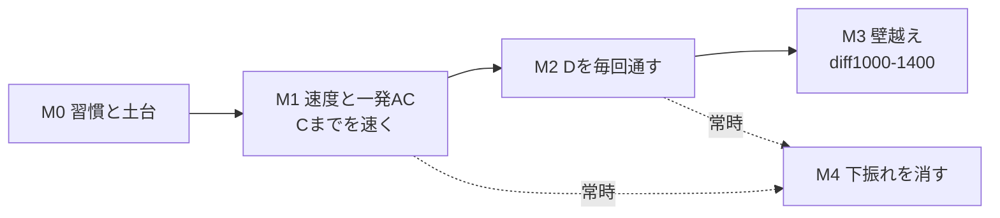

# AtCoder 攻略ロードマップ（Coji 個別最適）

> 根拠: [research/01-skill-analysis.md](research/01-skill-analysis.md)
> 前提: 精進時間 **週2〜3h** ／ 本番言語 **C++**（既存 `~/git/AtCoder` の Cpp + ac-library を使用）
> 目的: **AI 無しで、時間内に、落ち着いて正確に捌けること**（AWS Jam の AI 無しコンテストに通じる地力）

## レートは目標にしない

**レートは「積む対象」ではなく「今の実力の水面」**として扱う。落ちるところまで落ちて安定してよい。
茶下位で数ヶ月推移しても構わないし、**上げに行く義務は最初から選択肢に入れない**（そのぶん判断のコストを削る）。

競プロは「意味・糧」を接続しない**安全地帯**として持つ。楽しむため、そして勘を鈍らせないためのメンテ。
糧の主戦場は縦方向（runtime、言語内部、OSS 構造）へ移りつつあり、**競プロは「詰まった問題の教材」として常温保存**する。

だから以下の KPI は「レートを上げるための指標」ではなく、
**時間内に落ち着いて捌けているかを見るための代理指標**として読む。達成できない週があっても、それ自体は問題ではない。

## 基本戦略（なぜこの順番か）

分析の結論は「実力は既に 900+ 相当（＝**現状の分析結果であって目標ではない**）。
伸び悩みの要因は ①参加減 ②C までに時間を使い D/E に届かない ③WA/下振れ」。
だから**新しい難問をたくさん解くより、既にある地力を本番で出し切る訓練**が費用対効果が高い。週2〜3h という限られた時間なら特に。

M4（下振れ対策）は独立マイルストーンだが M1 以降**常時並走**する習慣。

## 週次の基本サイクル（全マイルストーン共通）

週2〜3h の配分テンプレート:
- **ABC 本番参加（約1.5h）** — 最優先。出られない週はバーチャル参加で代替。
- **本番直後の復習（30〜45分）** — 解けなかった1つ上の問題（多くは D か E）を、下の upsolve フローで通し直す。
- **余力（〜30分）** — 詰まり見本/テーマ埋めから1問。

> 精進サイトは [AtCoder Problems](https://kenkoooo.com/atcoder/) の Recommendation / Difficulty 順を使う。

### upsolve フロー（本番で落とした問題の通し直し）

1. **まず15分は自力で唸る**（すぐ AI／解説に投げない）
2. それでも詰まったら **解説 or AI に聞いてよい**
3. 聞いた後は、必ず **「解説を見ずに解く1問」を挟む**（自力の手を動かして戻す）
4. **反例は全数チェックで機械的に炙り出す** — N を小さくして、自分の解と愚直解を diff する

4 は ABC467 C で実際に効いた（N を 2〜7 で全数照合し、貪欲が壊れる入力を特定 → [knowledge/04](knowledge/04-greedy-vs-fix-first-abc467c.md) / #23）。
**WA の原因は頭で探すより機械で探す方が速い。** とくに「解法は合っているはず」と思い込んでいるときに効く。

---

## M0. 習慣と土台づくり（1〜2週間）

**狙い**: 「毎回出る」を仕組み化し、C++ の初動を速くする。参加減を最初に潰す。

やること:
- [ ] **参加の常態化**: 毎週の ABC をカレンダー固定。出られない週は後日バーチャル参加すると決める。
- [ ] **C++ テンプレ整備**: 既存 `~/git/AtCoder/Cpp` に、入出力高速化・よく使うマクロ・`ac-library` の include を揃えた提出テンプレを用意し、コンテスト開始時に即コピーできる状態にする。
- [ ] **インタラクティブのテンプレ**: `? ` / `! ` の書式、flush、質問回数のカウンタ（ABC466 C で初動の書式ミスに1回使った）。
- [ ] **詰まり見本7問のウォームアップ**（research/01 §5）: 未 AC で放置している解けるべき問題を潰す。
  - arc024_a / arc162_a / arc164_a / arc110_b / abc400_c / abc142_d / abc408_d
- [ ] 「1問あたりの想定時間」の感覚をつかむため、直近ABCのA/B/Cをバーチャルで測ってみる。

**完了条件（KPI）**: 提出テンプレが1コマンドで出せる ／ 詰まり見本7問を全 AC ／ 次のABCに参加登録済み。

---

## M1. 速度と一発AC — 「C までを速く」（3〜5週間 / 常時継続）

**狙い**: 本番の最大のボトルネック「C までに時間を使い果たす」を解消。速く正確に抜けて D に時間を残す。

やること:
- [ ] **ABC-C 早解きドリル**: 過去の ABC-C を diff 順（〜700）で、**1問20分以内・ノーWAを目標**に週2〜3問。時間を計る。
- [ ] **A/B は流し**: A/B で 5分以上使う/WA が出るパターンを記録し、テンプレ・スニペットで潰す。
- [ ] **提出前チェックリスト**: オーバーフロー(long long)・境界(N=1,0)・入力形式・制約の上限。
      research/01 §4 の **WA:AC = 2.8:1** を下げるのが狙い。
      **回数制限つきインタラクティブでは、上限と N の比（O(N) か O(N log N) か）から想定解の形が絞れる**（ABC466 C の教訓）。
- [ ] **WA が出た後のチェックリスト**（下記）

**完了条件（KPI）**:
- 直近ABC本番で **A/B/C を合計30分以内**で3完できた回が続く。
- 本番の **C までの WA を月あたり1回以下**に抑える。

### WA が出たときの手順 — 原因を「最初の仮説の外」へ探しに行く

C を落とした2戦は、**探した場所が最初に立てた仮説の中だけ**だった。

| | 最初の方針 | 立てた仮説 | 実際の原因 |
|---|---|---|---|
| ABC466 C | 二分探索（**正しい**） | 「アルゴリズムが間違っている」 | 質問回数 2N の制約（＝アルゴリズムの外） |
| ABC467 C | 貪欲（**枠組みごと誤り**） | 「実装がバグっている」 | 貪欲では解けない構造（＝実装の外） |

方針を疑ったかどうかで言えば2戦は逆向きだが、**答えが枠の外にあった**点は同じ。中で粘っても出てこない。

- 「**アルゴリズムが違う**」と思っているなら → **回数・出力形式・制約**を読み直す
- 「**実装がバグっている**」と思っているなら → **その方針で本当に解けるのか**を確かめる
- **TLE ではなく高速に WA** なら、まず回数超過・出力形式・制約を疑う（アルゴリズムより先に）
- 「その場の最善」を選ぶ解法を書いているなら → **その選択が、既に確定させた場所に影響しないか**を自問する
  （影響するなら貪欲は使えない。→ [knowledge/04](knowledge/04-greedy-vs-fix-first-abc467c.md) / #23）
- 確かめる道具が **全数チェック**（N を小さくして愚直解と diff）。本番中でも小さい N なら手で回せる

---

## M2. D を毎回通す（4〜6週間）

**狙い**: 着手すれば AC率98%（research/01 §3）の D に、毎回手を伸ばして通す。**ここが本番の成果に最も効くとみている**。

7月の3戦では、**D を通した回だけ perf が 1000 を超えた**（1068 / 463 / 523）。
ただし **n=3 の観測で、「D を通した回」は「C も通せた回＝セットとの相性が良かった回」でもある**（交絡あり）。
「D 以外は効かない」と確定できるデータではなく、[research/02](research/02-abc466-counterfactual-perf.md) の反実仮想と同じ向きに**強く再現された**段階
（[logs/2026-W29.md](logs/2026-W29.md) / #20）。

**M1（C を速く）は M2 の手段**という関係にある。ただし速さが無価値なのではなく、
**3完で止まっている限り速さが perf に現れない**（3完帯は 20分で632・59分で606）のに対し、
**D に届いた後は提出時刻がそのまま効く**（4完帯は 55分で1051・99分で896）。
※ これらの数値は **ABC466 の順位表を復元した反実仮想**であり、配点構成や参加者分布は回ごとに異なる。

やること:
- [ ] **ABC-D 埋め**: diff 800〜1200 の ABC-D を AtCoder Problems の Difficulty 順で週2問。解けたら「なぜその解法か（典型パターン名）」を一言メモ。
- [ ] **upsolve の固定化**: 毎回の本番で解けなかった D は、翌日までに上記の upsolve フローで通す。
- [ ] **典型の言語化**: 出てくる典型（累積和・座標圧縮・二分探索・union-find・bit全探索 等）を自分の言葉でメモ化し、再遭遇時の速度を上げる。

**完了条件（KPI）**: 直近5回のABC本番のうち **4回で D を AC**（本番 or 当日 upsolve 含めれば全回）。

---

## M3. 壁越え — diff 1000〜1400（6〜8週間）

**狙い**: research/01 §2 の壁（diff 1000 超で AC 数が半減）を厚くする。
同時に、ジャンル別の得手不得手を**体感でなくデータで確定**する。

やること:
- [ ] **ジャンル横断で diff 1000〜1200 を実測**: グラフ / DP / 数学(整数論・数え上げ) / データ構造 から各2〜3問。解けた/詰まったを記録し、**本当の弱点を特定**（主観「数学・DP苦手」の検証）。
- [ ] **弱点ジャンルの定番一巡（軽め）**: 実測で弱いと出たジャンルを重点化。DP が弱ければ [EDPC](https://atcoder.jp/contests/dp) の A〜L を少しずつ（週2〜3h でも数週で一巡可能）。
- [ ] diff 1200〜1400 を月数問、無理のない範囲で。

**完了条件（KPI）**: diff 1000〜1200 の AC を +20問 ／ 弱点ジャンルが **`research/03-weak-genres.md`** として文書化されている ／ ABC-E の着手回数が増える。

---

## M4. 下振れを消す（M1以降 常時並走）

**下振れ（旧称: 爆死）= perf<400** と定義する。

**狙い**: research/01 §1 の perf<400（68戦中11回）を無くす。
上振れの実力（直近20戦で 1000+ を6回）は既にあるので、**下振れが消えれば実力どおりの結果に落ち着く**。

レートを守るためではなく、**「解けたはずの問題を落として嫌な気持ちで終わる回」を減らす**ための型として扱う。

やること:
- [ ] **撤退・時間配分の型**: 「1問に◯分詰まったら次へ/見直しへ」のルールを決めて本番で守る。
      2戦続けて未整備のまま同じ失敗をしている（ABC466 は C 系に約68分、ABC467 は B の AC 後の約88分の大半。
      **どちらも記録の無い区間を含む推定値**）。
      例:「C の最初の WA から25分でロジックを直せなければ、いったん D/E を読みに行く」
- [ ] **見直しの型**: 提出前チェックリスト（M1）を本番でも必ず通す。
- [ ] **下振れレビュー**: perf<600 だった回は原因を1行で記録（詰まり/WA連発/時間切れ/難セット）。パターンを潰す。
      ※ この 600 は**振り返りを起動する閾値**であって、達成すべき水準ではない。

**完了条件（KPI）**:
- **結果指標**: 直近10戦で **perf<400 がゼロ**。
- **行動指標**（こちらが本体。自分で制御できる）:
  - 決めた**撤退ルールを守れた**回が、直近10戦のうち **8回以上**（ルールを決めた回から数え始める）
  - perf<600 だった回に**1行レビューを書いた**割合が **100%**（自分だけで達成できるので満点を条件にする）

> **「最低 perf を◯◯以上で安定させる」という形の KPI は置かない。**
> perf の下限を固定することは、実質的にレートの下限を固定することと同じで、
> 「茶下位で数ヶ月推移しても構わない」という前提と両立しないため。

---

## 全体の目安（ゆるいマイルストーン）

| 期間の目安 | 状態 |
|-----------|------|
| 〜1ヶ月 | 毎週参加が習慣化、C までを速く抜ける |
| 〜3ヶ月 | D を毎回通す、下振れの回が減る |
| 〜6ヶ月 | 壁を越えて diff 1000〜1200 が射程 / AI 無しの時間内実戦に手応え |

**数値目標はレートではない。** 本質は「**AI 無しで、時間内に、落ち着いて正確に捌けること**」。
KPI はそのための代理指標であって、順位表の位置を上げるためのものではない。

## 進捗管理

各マイルストーン M0〜M4 を GitHub Issue に分解して管理する（この PLAN.md がマスター）。

| マイルストーン | Issue |
|---------------|-------|
| M0 習慣と土台 | #3 |
| M1 速度と一発AC | #4 |
| M2 Dを毎回通す | #5 |
| M3 壁越え+弱点実測 | #6 |
| M4 下振れを消す | #7 |

週次サイクルの記録は `logs/`（例: `logs/2026-W28.md`）に軽く残し、下振れレビューや弱点実測の材料にする。
本番で詰まった問題の分析は `knowledge/` に残す（これが「教材として常温保存」の実体）。
