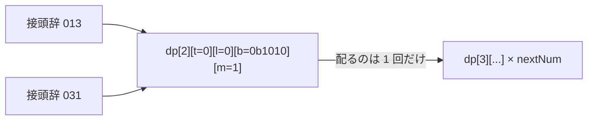

# ABC465 E（桁DP）upsolve の振り返り

- 問題: [ABC465 E](https://atcoder.jp/contests/abc465/tasks/abc465_e) — `1..N`（N < 10^500）のうち、次の3条件の**ちょうど1つだけ**を満たす数の個数を mod 998244353 で求める
  1. 3 の倍数である
  2. 十進表記に `3` が含まれる
  3. 十進表記にちょうど 3 種類の数字が使われる
- AC: [提出 #77335219](https://atcoder.jp/contests/abc465/submissions/77335219)（2026-07-11）
- 期間: 2026-07-05 〜 07-11（6日、実働は通退勤中心）
- 思考ログ: X の開発スレッド 101 ツイート（解説を鵜呑みにせず、自力で状態を導く方針で進めた記録）

このドキュメントは「想定解からどれだけ遠回りしたか」の記録ではなく、
**どの気づきが AC に繋がり、何を理解していなかったか**を残すためのもの。

---

## 1. 本丸: dp の状態は「接頭辞の十分統計量」である

今回の6日間のうち、大半の時間はこの一文を知らないことに起因していた。

> **dp の状態は「そこに至る接頭辞をすべて忘れてよい」という宣言であり、**
> **忘れた情報を遷移でもう一度回してはいけない。**

`dp[d][tight][leadingZero][bitSet][mod]` は「**d 桁目まで置き終わった**状態」である。
つまり **d 桁目の数字は、すでに `bitSet` / `mod` / `tight` / `leadingZero` の中に溶けている**。

`013` と `031` は、その先の未来に対して完全に同じ振る舞いをする。だから同じ状態
`dp[2][0][0][0b1010][1]` に潰される。潰した以上、**そこから配るのは状態あたり1回**であって、
「その状態に至った接頭辞の数」だけ配ってはいけない。



### 当時の分岐点（7/9 のログ）

> m も b も今の状態として確定しているものとして考えるので, nowNum などの情報はいらない
> **だが nowNum を考えないと今の桁の全探索が出来ない**

前半で正解に触れ、後半で自分で否定している。ここが病巣だった。
「今の桁の全探索」は `dp[d]` を作った**前の遷移**ですでに終わっている。今やるのは次の桁の全探索だけ。

---

## 2. AC コードの分析: `nowNum` は遷移に一切効いていなかった

AC した実装は、遷移が `nowNum`（今の桁）× `nextNum`（次の桁）の二重ループになっていた。
その結果、同じ状態を `nowNum` の個数だけ配ってしまい、`checkedDp`（もう配ったかのフラグ）で
二重配布を止めることで AC した。

しかし**遷移の本体に `nowNum` は一度も現れない**。

```cpp
// nowNum が現れるのは以下の 3 箇所だけ（すべて b の列挙のためだけ）
for (int nowNum = 0; nowNum <= ((t == 0) ? 9 : curNum); nowNum++)   // (a) ループ上限
    if (l == 0 && ((b & (1LL << nowNum)) == 0)) continue;           // (b) b のフィルタ
    b = (nowNum == 0) ? b : b | (1LL << nowNum);                    // (c) b の補正

// 遷移本体が使うのは t, l, b, m, nextNum のみ
int nextTight   = (nextNum == maxNum && t == 1) ? 1 : 0;
int nextLeading = (l == 1 && nextNum == 0) ? 1 : 0;
int nextBit     = (nextNum == 0 && l == 1) ? b : (b | 1LL << nextNum);
int nextModulo  = (m * 10 + nextNum) % 3;
```

つまり `nowNum` ループは「状態を配る対象として拾うか」だけの回りくどい列挙装置で、
`checkedDp` はその冗長さを打ち消す逆操作。**片方を消せば、もう片方も要らなくなる。**

`checkedDp` が必要になった事実こそが、「状態は十分統計量だから1回配れば足りる」ことの**証明**だった。

### 正しい遷移（`nowNum` / `popcount` 枝刈り / `checkedDp` をすべて削除）

```cpp
for (int d = 0; d < n - 1; d++) {
    int neNum = s[d + 1] - '0';
    for (int t = 0; t < 2; t++)
      for (int l = 0; l < 2; l++)
        for (int b = 0; b < (1 << 10); b++)
          for (int m = 0; m < 3; m++) {
              ll cur = dp[d][t][l][b][m];
              if (cur == 0) continue;          // 到達不能な状態はここで自然に落ちる

              int maxNum = (t == 0) ? 9 : neNum;
              for (int nextNum = 0; nextNum <= maxNum; nextNum++) {
                  int nt = (t == 1 && nextNum == neNum) ? 1 : 0;
                  int nl = (l == 1 && nextNum == 0) ? 1 : 0;
                  int nb = (l == 1 && nextNum == 0) ? b : (b | (1 << nextNum));
                  int nm = (m * 10 + nextNum) % 3;
                  dp[d + 1][nt][nl][nb][nm] = (dp[d + 1][nt][nl][nb][nm] + cur) % MOD;
              }
          }
}
```

| 消えるもの | 消える理由 |
|---|---|
| `popcount(b) > d+1` の枝刈り | この条件を満たす状態は dp が 0 のまま。`if (cur == 0) continue;` が代行する（実測: AC コードでこの枝刈りが「dp != 0 の状態」を弾いた回数は **0 回** = 完全な no-op だった） |
| `checkedDp`（約 50MB） | 状態あたりループが1周しか来ないので、二重配布が構造的に起こらない |
| `nowNum` ループ | 状態に畳み込み済みの情報を回していただけ |

さらに `b` は 10bit で足りるので、宣言も `1LL << 11` → `1 << 10` にできる（dp が 100MB → 50MB）。
ただし**元コードの集計ループは `for (int b = 1; b < 1LL << 11; b++)` で 2047 まで回している**ので、
宣言だけ縮めて集計を据え置くと `b >= 1024` で範囲外アクセスになる。両方を直すこと。

ループ本体の実行回数（最悪ケース N = 500 桁の 9、実測）:

| | 状態の列挙 | `nextNum` の配布 | 合計 |
|---|---|---|---|
| 元の AC コード | 47,554,548 | 15,024,620 | 62,579,168（約 6.3 千万） |
| 書き直し版 | 6,131,712 | 15,024,620 | 21,156,332（約 2.1 千万） |

約 3 倍。**10 倍にならない理由は、配布コスト（1,500 万回）が両版で完全に同一だから**である。
`nowNum` ループを消して減るのは状態の列挙部分だけ（7.8 倍）で、それが共通の配布コストに薄められて総合 3 倍になる。
（`checkedDp` のおかげで、元コードも配布自体は状態あたり1回しかしていない。無駄だったのは列挙の空回りのほう）

> なお上のコードは遷移だけを抜き出したもの。配列宣言・初期化（`dp[0][...]`）・答えの集計（`dp[n-1]` の走査）は
> 元の AC コードのままで動く。5章の全数比較に使うときはそこを補うこと。

### 地雷: ループ変数 `b` の書き換え

```cpp
for (int b = 0; b < 1LL << 10; b++) {
    ...
    b = (nowNum == 0) ? b : b | (1LL << nowNum);   // ループカウンタそのものを書き換えている
```

以降のイテレーションが飛ぶ。今回は
「`l == 0` のときは直前のフィルタでビットが立っていることが保証され `b | (1<<nowNum) == b`」
「`l == 1` のときは飛んだ先の dp が全部 0」
という**二重の偶然**で助かっていた。上の書き直しではこの行ごと消える。

---

## 3. AC に直結した3つの気づき

いずれも「**計算するもの**ではなく**状態として持つもの**」への転換であり、同じ根から出ている。

| 日時 | 気づき | 内容 |
|---|---|---|
| 7/7 12:37 | `isLeadingZero` を「ずっと 0 が続いているか」のフラグとして持つ | 「先頭かどうか」ではなく状態として定義し直した。leading zero 中の `0` は `bitSet` に入れない、が確定した（`nextBit`） |
| 7/11 03:37 | `modulo` を 0〜2 で全探索する | mod を「今の桁から計算するもの」から「状態」へ。`55` でも `5` でも `m = 2` になってしまう不具合の解消 |
| 7/11 08:10 | `checkedDp` で既に配ったかを見る | 最後のクリティカル。上の一般化ができていれば不要だった（→ 2章） |

6日かけて「十分統計量」を実地で3回再発見していた、というのが今回の実態。

> **tight の遷移式に注意**: 正しくは `nextTight = (t == 1 && 次の桁 == 上限桁)` であり、**`leadingZero` は関与しない**。
> 7/7 のログでは「次の桁が上限 && isLeadingZero = 0 なら nextTight = 1」と書いていたが、
> 最終的な AC コードは `t == 1` で判定している。`t == 1 ⇒ l == 0` は成り立つが逆は成り立たないので、
> `l == 0` を条件にすると tight を過剰に立てて壊れる。

---

## 4. assert は「状態の妥当性」ではなく「質量の保存」を主張せよ

枝刈りと assert は、書く式が同じでも**向きが逆**である。

- **枝刈り (`continue`)**: 「不正な状態が dp に存在する」ことを前提として受け入れ、黙って飛ばす。バグは生き残る。
- **assert**: 「不正な状態は存在しないはずだ」と主張する。存在した瞬間に、その桁 `d` で停止する。

ただし今回、**この対比だけでは最終ボスに届かなかった**。ここが一番の学びである。

### 状態不変条件の assert では二重カウントは捕まらない

素朴に思いつくのは、状態の妥当性を主張する assert である。

```cpp
#include <cassert>

// cur == 0 の判定より後（＝到達可能な状態と分かった後）に置く
assert(!(l == 1 && b != 0));              // leading zero 中に数字集合は空のはず
assert(popcount((uint32_t)b) <= d + 1);   // d+1 桁で d+1 種類以上は使えない
assert(!(l == 1 && m != 0));              // まだ数でないなら mod は 0
```

これらは**すべて真の不変条件**である（AC コード上で違反 0 件）。しかし——

**`checkedDp` を外した（＝二重配布が起きている）コードに当てても、一度も発火しない**（実測）。

理由は構造的である。遷移は1桁につきビットを1本 OR するだけなので、`popcount(b) <= d+1` は
**配る回数に依存しない不変条件**なのだ。二重配布はカウントを水増しするだけで、状態の妥当性は壊さない。

> **二重カウントは「状態の妥当性」の破れではなく「質量（個数）」の破れである。**
> だから状態不変条件の assert では原理的に捕まえられない。

（7/8 に見つけた `popcount(b) > d+1` の枝刈りは、AC コード上では「dp != 0 の状態」を一度も弾いていない、
完全な no-op だった。当時の壊れた実装で不正な `b` に値が入っていたのは、二重配布とは別の原因である。）

### 捕まえられるのは保存則の assert

数えている**総量**を主張すればよい。桁 `d` の層に入っている dp の総和は、
「`s[0..d]` を数と見た値 + 1」（= 接頭辞 `0` 〜 `s[0..d]` の個数）に一致するはずである。

```cpp
// 各層 d を作り終えたら質量を検算する
ll sum = 0;
for (int t = 0; t < 2; t++) for (int l = 0; l < 2; l++)
  for (int b = 0; b < (1 << 10); b++) for (int m = 0; m < 3; m++)
      sum = (sum + dp[d][t][l][b][m]) % MOD;

ll expect = 0;
for (int i = 0; i <= d; i++) expect = (expect * 10 + (s[i] - '0')) % MOD;

assert(sum == (expect + 1) % MOD);
```

これは二重配布バグに対して **N = 110 の d = 2 で即座に発火する**（最小反例が壊れる、まさにその層で停止する）。
「assert で最終ボスに直行できた」が本当に成り立つのは、この形だけである。

**教訓: 数え上げ DP の assert は、状態の形ではなく数えている量に対して書く。**

### AtCoder で使えるか

**使える。提出コードに含めて問題ない。**

- `<cassert>` は標準ヘッダで、AtCoder のコンパイルオプションに `-DNDEBUG` は入っていないため assert は生きたまま動く。
- assert が失敗すると `abort()` するので、判定は **WA ではなく RE (Runtime Error)** になる。
  → 「WA だが assert は通った」と「RE = 自分の想定が壊れた」を区別できるのは利点。
- ただし数千万回転のホットループでは定数倍が効くので、ローカル専用にするのが実務的。

```cpp
// AtCoder は ONLINE_JUDGE を自動定義するので、ローカルに -DLOCAL を渡す必要すらない
#ifndef ONLINE_JUDGE
  #define ASSERT(x) assert(x)
#else
  #define ASSERT(x) ((void)0)
#endif
```

ローカルは `g++ -std=gnu++20 -fsanitize=undefined,address ...` でコンパイルする。
（`-fsanitize=address` は 7/6 に踏んだ「main 内の多重配列で Stack overflow」も原因付きで教えてくれる）

---

## 5. 検証手段: サンプルで試すことと全数比較は別物

今回の二重配布バグの引き金は **`popcount(b) >= 2`（接頭辞が 2 種類以上の数字を使っている）** である。
`l == 0` のときフィルタ `b & (1 << nowNum)` を通る `nowNum` は「`b` に立っているビットの数」だけあるので、
その回数ぶん配られてしまう（接頭辞どうしの衝突は不要）。
（厳密には `t == 1` のとき `nowNum <= curNum` なので「`curNum` 以下のビットの数」。tight 状態は各層に1個だけなので結論は変わらない）

つまり 2 桁の N では `d = 0` しか回らず `popcount(b)` は必ず 1 なので、**原理的に出ない**。
実測でも 2 桁の N は 90 件すべて正常、3 桁の N は 900 件中 890 件が破綻し、
**最小反例は N = 110**（正 42 / 誤 46）だった。

試したのは N = 6, 12, 45（2 桁まで）と N = 1013（サンプル3）。
つまり **45 と 1013 の間が空白**で、そのために「桁が深い場所での目視ログ」に追い込まれた。
N = 110 まで全部試していれば、目視すべきログは 3 桁に閉じ込められていた。

愚直解との全数比較を回せば、**壊れる最小の N が自動で出る**。

```cpp
// #include <bits/stdc++.h> / -std=gnu++20 前提（popcount は C++20 の <bit>）
int brute(int N) {
    int c = 0;
    for (int x = 1; x <= N; x++) {
        int cnt = 0;
        if (x % 3 == 0) cnt++;
        string t = to_string(x);
        if (t.find('3') != string::npos) cnt++;
        int b = 0;
        for (char ch : t) b |= 1 << (ch - '0');
        if (popcount((unsigned)b) == 3) cnt++;
        if (cnt == 1) c++;
    }
    return c;
}
// N = 1..3000 で回し、桁DP の出力と食い違う最小の N を出す
// （dp / checkedDp はグローバルなので、試行ごとにクリアすること）
```

実際にやったのは `05 → 055 → 0555 → 0550` を目視で追う探索で、これが最大の時間損失だった。

「小さい N でやる」のではなく「**小さい N を全部やる**」。

---

## 6. 次に持ち越すチェックリスト

桁DP に限らず、DP を自力で設計するときに使う。

- [ ] `dp[i][...]` の `i` は「**i 桁目まで置き終わった**」なのか「これから置く」なのかを最初に固定する
- [ ] 遷移の本体で、**状態に含まれない変数**を使っていないか（使っていたら二重カウントの疑い）
- [ ] 「同じ状態に潰れる2つの接頭辞」を1組手で挙げ、配る回数が1回であることを確認する
- [ ] **数えている量**（層の総和 = 何通りあるはずか）の保存則を `ASSERT` で書く ← 二重カウントを捕まえられる唯一の assert
- [ ] 状態の不変条件も `ASSERT` で書く（枝刈りで隠さない）。ただしこれでは二重カウントは捕まらないと知っておく
- [ ] 愚直解を書き、小さい N を**全数**比較して最小反例を得てからログを読む

---

## 補足: 解説を先に読まない方針について

今回は「解説の答えにとらわれず、別の解法があり得るのではないか」という意図で、
最初から状態を決めずに自力で答えを導く方針を取った。この方針自体は維持してよい。

実際、AC したコードは想定解と**同じ状態を持ちつつ、遷移は独自の形**（`nowNum` × `checkedDp`）になっており、
「解説とは異なる形で AC する」は起きていた。

そのうえで、自力導出を支えるのは「先に状態を決めること」ではなく、
**自分が導いた状態を、自分で反証できるようにすること**（愚直解との全数比較 + assert）。
この2つは解説を一切見ずに使える道具であり、探索の自由度を一切損なわない。
