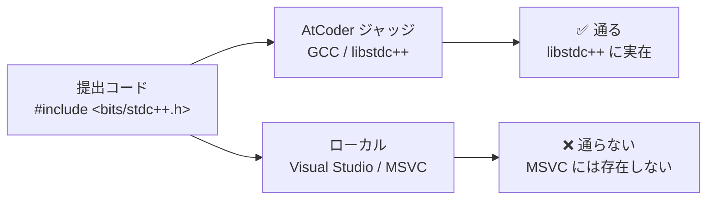

# MSVC で `#include <bits/stdc++.h>` を使えるようにする

対象: ローカル環境 `~/git/AtCoder/Cpp/Cpp.sln`（Visual Studio 2022 / MSVC v143）
関連: [#29](https://github.com/bubbleShaker/atcoder-roadmap/issues/29) ／ 実装: [bubbleShaker/AtCoder#7](https://github.com/bubbleShaker/AtCoder/issues/7)

## 何が困っていたか

AtCoder に提出するコードでは `#include <bits/stdc++.h>` 一行で済むのに、
手元の Visual Studio では通らないので、ローカル検証のたびに
`<iostream>` `<vector>` … と個別 include に書き換える必要があった。

## なぜ使えないのか

`<bits/stdc++.h>` は **C++ の標準ヘッダではない**。
GCC の標準ライブラリ実装である **libstdc++ の内部ヘッダ**で、中身は
「標準ヘッダを全部 include する」だけのものである。



MSVC は標準ライブラリの実装が別物（MSVC STL）なので、libstdc++ の内部ヘッダは持っていない。
つまり「バグ」でも「設定漏れ」でもなく、**そもそも別の処理系の私物ヘッダを借りようとしていた**というだけ。

## 採った対処

同名のヘッダを自分で用意して、コンパイラのインクルードパスに通した。

```
AtCoder/Cpp/
  include/
    bits/
      stdc++.h      ← 新規作成（MSVC 互換版）
  Cpp/
    Cpp.vcxproj     ← インクルードパスに ..\include を追加
    Submission.cpp
```

### 選択肢と、なぜこれにしたか

| 方式 | 利点 | 欠点 |
|---|---|---|
| **リポジトリ内に置く**（採用） | git 管理される。VS 更新・マシン移行で消えない。管理者権限不要 | プロジェクトごとに設定が要る |
| MSVC の include フォルダに置く | 設定不要で全ソリューションに効く | 管理者権限が要る。**VS を更新すると消える**。リポジトリに残らない |

既存の `<atcoder/all>` が後者の方式（ac-library を `C:\Program Files\...\MSVC\14.44.35207\include\atcoder\` に手動コピー）で動いていたが、
これは VS の更新でパスのバージョン番号が変わると丸ごと消える。同じ轍を踏まないよう前者にした。

### 中身：libstdc++ 版をコピーしてはいけない

GCC の `bits/stdc++.h` をそのまま持ってくると、`<ext/*>` や `<cxxabi.h>` といった
**GCC 固有ヘッダ**が混ざっていて MSVC で壊れる。
そこで MSVC の include ディレクトリを実際に `ls` して、**実在するヘッダだけを列挙**した。

```cpp
#pragma once

// _HAS_CXX17 / _HAS_CXX20 / _HAS_CXX23 を得るために最初に読む
#include <version>

#include <algorithm>
#include <vector>
// … （無条件に読めるもの）

#if _HAS_CXX17
#include <any>
#include <charconv>
#include <optional>
#include <string_view>
#include <variant>
// …
#endif

#if _HAS_CXX20
#include <bit>
#include <format>
#include <ranges>
#include <span>
// …
#endif

#if _HAS_CXX23
#include <expected>
#include <generator>
#include <print>
// …
#endif
```

**`_HAS_CXX20` とは**（見慣れないマクロなので補足）
MSVC が「今どの言語標準でコンパイル中か」を教えてくれるマクロ。
`/std:c++20` 以上なら `1` になる。`<version>` を読むと定義される。

これが必要な理由は、たとえば C++14 設定のまま `<format>` を include すると
MSVC が「C++20 以降でしか使えません」という警告（STL4038）を出すため。
言語標準に応じて読むヘッダを切り替えることで、どの構成でも警告ゼロで通るようにしている。

### プロジェクト設定

`Cpp.vcxproj` の**全 4 構成**（Debug/Release × x64/Win32）に追記した。

```xml
<AdditionalIncludeDirectories>$(ProjectDir)..\include;%(AdditionalIncludeDirectories)</AdditionalIncludeDirectories>
```

- `$(ProjectDir)` は vcxproj のあるフォルダ。`Cpp\Cpp\..\include` → `Cpp\include` に解決される。
  絶対パスを書かないので、リポジトリをどこに clone しても動く。
- 末尾の `%(AdditionalIncludeDirectories)` は「**既存の設定を引き継ぐ**」という意味。
  これを書かないと元から入っていたパスを消してしまう。

あわせて `LanguageStandard` を全構成 `stdcpp20` に統一した（従来は Debug|x64 のみ C++20、他は C++14 のまま）。
AtCoder のジャッジが C++20 以降なので、手元も揃えた方が実態に合う。

## 踏んだ落とし穴

### 1. 日本語コメントで警告 C4819

```
warning C4819: ファイルは、現在のコード ページ (932) で表示できない文字を含んでいます。
```

MSVC は既定でシステムのコードページ（日本語環境は 932 = Shift_JIS）としてソースを読む。
UTF-8 の日本語コメントを入れると「読めない文字がある」と警告される。

**対処**: ファイルを **BOM 付き UTF-8** で保存する。BOM があると MSVC が UTF-8 だと認識する。

```powershell
$p = 'path\to\file.h'
$t = [System.IO.File]::ReadAllText($p)
[System.IO.File]::WriteAllText($p, $t, (New-Object System.Text.UTF8Encoding $true))
```

### 2. 構成によって言語標準が違った

最初は C++17 以降のヘッダを無条件に include していたが、
Release 構成が C++14 のままだったため `<optional>` `<filesystem>` 等で STL4038 警告が大量に出た。
→ `_HAS_CXX17` のガードを追加し、あわせて全構成を C++20 に統一して解決。

### 3. x86（32bit）構成は元から通らない

これは今回の変更とは無関係の既存の制約。
ac-library が 64bit 専用の組み込み関数 `_umul128` を使っているため、x86 ではコンパイルできない。

```
error C3861: '_umul128': 識別子が見つかりませんでした
```

AtCoder のジャッジは 64bit なので、**x64 だけ使えばよい**。x86 構成は気にしなくてよい。

## 結果

`Submission.cpp` の include が 8 行から 2 行になった。

```cpp
#include <bits/stdc++.h>
#include <atcoder/all>
```

Debug|x64 / Release|x64 とも **警告ゼロでビルドが通り、実行結果も一致**することを確認済み。
提出コードとローカルコードで include を書き換える手間がなくなった。

## 残課題

- **ac-library がまだ MSVC のインストールフォルダ依存**
  → [bubbleShaker/AtCoder#8](https://github.com/bubbleShaker/AtCoder/issues/8) で同じ流儀（リポジトリ内 + インクルードパス）に揃える予定。
  現状は VS を更新すると `<atcoder/all>` が壊れる。
- **コンパイル時間**
  `<regex>` `<format>` `<ranges>` あたりが重い。体感が悪ければプリコンパイル済みヘッダー（PCH）にする手がある。
  コンパイル対象が `Submission.cpp` 1 本だけなので導入は容易。
- **`using namespace std;` との併用**
  全ヘッダを取り込むため、`size` `count` `next` `prev` `distance` `left` `right` などを変数名にすると
  標準ライブラリの名前と衝突することがある。ローカルだけコンパイルが通らない時はこれを疑う。
