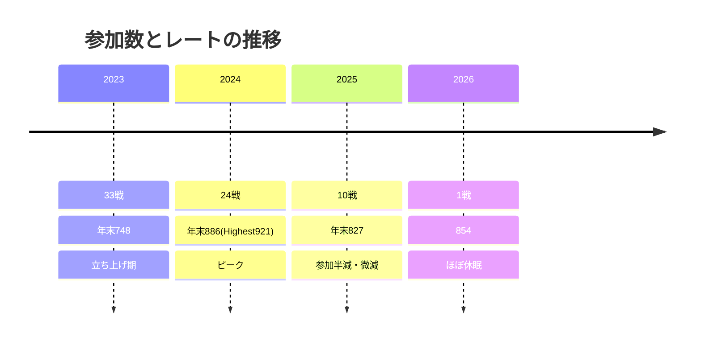

# 01. 成績・精進データ客観分析（ユーザー: Coji）

対象: https://atcoder.jp/users/Coji ／ 分析日: 2026-07-05
データ源: AtCoder Problems API（kenkoooo、提出全件 / difficulty モデル）、AtCoder 公式レート履歴 JSON

## サマリ（結論先出し）

1. **停滞の最大要因は「実力の頭打ち」より「参加数の激減」**。年間 rated コンテスト数が 33(2023)→24(2024)→10(2025)→1(2026) と急減。レートが動かないのは、更新機会そのものが減っているから。
2. **難易度の壁は diff 1000〜1200 帯**。diff 1000 未満は各帯 100 件超を AC しているが、1200 を超えると急に解けていない。ここを埋めるのが数値上の伸びしろ。
3. **本番で D/E 問題に手が届いていない**。ABC の A/B/C は AC 率 100% だが、D は全コンテスト中 64 回・E は 16 回しか着手できていない。ただし**着手すれば AC 率は高い（D 98%・E 88%）**。つまり弱点は「解く力」より「そこまで速く到達する力」。
4. **成績の分散が大きい**。直近 20 回のパフォーマンスは 378〜1188 と乱高下、爆死（perf<400）が 68 戦中 11 回。安定して 800 を出せていない。
5. **主観（グラフ得意/数学・DP 苦手）はデータでは確証できず**。問題ジャンルの機械分類は精度が低く（AC 1709 問中 1344 問が分類不能）、明確な裏付けは取れなかった。弱い信号として「解いたグラフ問題の平均難易度が他ジャンルより高め」はあるが、サンプルが小さく結論に使えない。

---

## 1. レート推移と停滞の形

| 年 | rated 参加 | 年末レート | 平均perf | perf標準偏差 | perf最小 | perf最大 |
|----|-----------|-----------|---------|-------------|---------|---------|
| 2023 | 33 | 748 | 633 | 323 | -137 | 1248 |
| 2024 | 24 | 886 | 890 | 249 | 324 | 1328 |
| 2025 | 10 | 827 | 786 | 216 | 378 | 1118 |
| 2026 | 1 | 854 | 1068 | – | 1068 | 1068 |

- **Highest 921（2024年）→ 現在 854**。実力のピークは 2024 年で、以後は微減して横ばい。
- 総 rated 68 戦。**perf<400 の爆死が 11 回、perf>1100 の好成績が 8 回**。上振れの実力はある（最大 1328、直近も 1188/1118/1068）のに、下振れが平均を殺している。
- 直近 20 戦の perf: `[1188, 658, 1059, 932, 735, 694, 1000, 574, 1116, 813, 876, 973, 378, 900, 1118, 817, 448, 677, 860, 1068]`（平均 844 / 標準偏差 219）。
  - **1000 超を 6 回**出せている＝地力はレート 1000 相当に届きうる。にもかかわらずレートが 854 なのは、間に挟まる 378 / 448 / 574 の爆死が原因。

**→ 示唆: 停滞を割る第一歩は「毎回出ること」。** perf の実力（平均 844、上振れ 1000+）はレート 900+ に見合う。参加が減った分だけ、下振れ 1 回の傷が回復されずに残っている。

---

## 2. AC 済み問題の難易度分布（どこに壁があるか）

difficulty モデルのある AC 問題 1509 問（うち 200 問は新しすぎ/データ無しで難易度不明）。

| difficulty 帯 | AC 数 |
|--------------|------|
| [0,200) | 136 |
| [200,400) | 130 |
| [400,600) | 117 |
| [600,800) | 136 |
| [800,1000) | 102 |
| **[1000,1200)** | **63** ← 急減 |
| [1200,1400) | 42 |
| [1400,1600) | 17 |
| [1600,1800) | 13 |
| [1800,2000) | 5 |
| 2000以上 | 11 |

- **diff 1000 未満は各帯 100 問超**を安定して AC。地力の土台はここまで固い。
- **diff 1000 を境に半減（102 → 63 → 42 → 17）**。レート 800〜900 の水準として自然だが、レート 1000+ に上がるには **diff 1000〜1400 帯を「たまに解ける」から「安定して解ける」に変える**必要がある。ここが数値上の主戦場。

**→ 示唆: 精進のターゲット難易度は diff 1000〜1400。** 特に 1000〜1200 を厚く埋める。

---

## 3. 本番での「到達点」— ABC 設問別 AC 率

ABC の設問インデックス別（rated 提出ベース）:

| 設問 | 着手数 | AC 数 | AC 率 |
|-----|-------|------|------|
| A | 213 | 213 | 100% |
| B | 213 | 213 | 100% |
| C | 156 | 156 | 100% |
| D | 64 | 63 | **98.4%** |
| E | 16 | 14 | **87.5%** |
| F | 2 | 2 | 100% |

- **A/B/C は完全に取れている**。C まではノーミス。
- **D は着手数が 64 しかない**（A/B の 213 に対して）＝多くのコンテストで **D にたどり着く前に時間切れ or C で時間を使い果たしている**。だが着手すれば 98% 通す。
- **E に至っては着手 16 回のみ**。これも通せる時は通せている（88%）。

**この非対称が核心**: 弱点は「D/E が解けない」ではなく「**D/E に手をつけられるところまで速く到達できていない**」。C までを速く正確に処理して D に時間を残せれば、そのまま perf が上がる。これは AWS Jam の「AI 無しで時間内に捌く」目的と完全に一致する課題。

**→ 示唆: 目標は「毎回 D を通し、E に手を伸ばす」。そのための鍵は速度と正確性（下記）。**

---

## 4. 正確性（WA の多さ）— 隠れたロス

提出結果の内訳:

| 結果 | 件数 |
|-----|-----|
| AC | 2397 |
| **WA** | **851** |
| TLE | 109 |
| RE | 87 |
| CE | 29 |
| MLE | 1 |

- **AC:WA ≒ 2.8:1**。WA が 851 件は多い。1 AC につき平均 0.35 回 WA を出している計算。
- 本番では WA 1 回 = ペナルティ 5 分 + 修正時間。C で 2 回 WA を出すと、D に届かなくなる（上記 3 の構造とつながる）。
- TLE 109 / RE 87 も、計算量見積り・境界処理のミスを示唆。

**→ 示唆: 「一発 AC 率」を上げる訓練（提出前の手元検証・コーナーケース確認）が、そのまま到達速度＝perf に効く。**

---

## 5. 取りこぼし（解けるべきなのに未 AC）

未 AC のまま放置している問題は少ない（着手 1736 問中、未 AC は 27 問のみ）。そのうち「解けるべき」難易度帯（diff 0〜1000）は 7 問だけ:

| 問題 | diff | 名前 |
|-----|------|-----|
| arc024_a | 257 | くつがくっつく |
| arc162_a | 446 | Ekiden Race |
| arc164_a | 532 | Ternary Decomposition |
| arc110_b | 655 | Many 110 |
| abc400_c | 702 | 2^a b^2 |
| abc142_d | 827 | Disjoint Set of Common Divisors |
| abc408_d | 950 | Flip to Gather |

- 取りこぼし自体は少なく、**精進の網羅性は高い**。＝「問題を解いていない」のが原因ではない。
- ここに ARC の A/B と ABC の数論系（`2^a b^2`, `共通約数`）が並ぶのは、**§参考: 数学系がやや弱い**という主観と整合する弱い傍証。

**→ 示唆: この 7 問は「詰まりの見本」。ロードマップの最初にウォームアップとして潰すとよい。**

---

## 6. ジャンル別の強み/弱み（※信頼度低）

問題名・コンテスト種別からの機械推定のため精度が低く、**AC 1709 問中 1344 問が分類不能**。参考値として:

| 推定ジャンル | AC 数 | 平均 diff |
|------------|------|----------|
| グラフ（推定） | 47 | 746 |
| データ構造（推定） | 23 | 568 |
| 数学（推定） | 40 | 397 |
| 貪欲（推定） | 12 | 337 |
| 実装/シミュ（推定） | 84 | 149 |
| DP（EDPC等・確定） | 11+ | – |

- 弱い信号として「グラフの平均難易度が高め（746）＝相対的に高難度まで踏み込めている」はあり、**「グラフ得意」主観と方向は一致**。
- 一方 DP の確定分類が 11 問と極端に少なく、EDPC(Educational DP Contest) 等の**定番 DP 精進が手薄な可能性**（＝「DP 苦手」主観と整合しうる）。
- ただしいずれもサンプルが小さく分類も粗いため、**ロードマップの根拠には使わない**。ジャンル別の実力は、次段で「意図的に各ジャンルの diff 1000〜1200 を解かせて反応を見る」方が正確。

---

## まとめ: ロードマップへの示唆

データで裏付けられたこと:
- ✅ 停滞の主因は **参加数の激減**（33→1）。まず「毎回出る」だけでレートは動きうる。
- ✅ 地力の壁は **diff 1000〜1200**。ここを厚く埋めるのが数値上の伸びしろ。
- ✅ 本番の弱点は **D/E への到達速度**（能力より速度）。C までを速く正確に。
- ✅ **WA が多い（AC:WA=2.8:1）**。一発 AC 率の改善が速度に直結。

主観とズレた/確証できなかったこと:
- ⚠️ 「グラフ得意/数学・DP 苦手」は機械分類の精度不足で確証できず。方向性としてグラフは相対的に強め・DP 精進は手薄そう、という弱い傍証どまり。→ ロードマップ内で各ジャンルの diff 1000〜1200 を実際に解かせて実測する。

データが取れなかったこと:
- ✖ 各提出の実行時間（速度の直接指標）は今回集計しきれず。必要なら次段で execution_time を集計する。

### ロードマップ設計方針（次 Issue へ）
1. **参加の常態化**: ABC は毎回 rated 参加（or バーチャル参加）を最優先の習慣に。
2. **速度と一発 AC**: ABC の A〜C を「20 分以内・ノーWA」で抜ける典型埋め（AWS Jam の時間内実戦力に直結）。
3. **壁越え精進**: diff 1000〜1400 を対象に、ジャンル横断で厚く。DP は EDPC で定番を一巡（手薄仮説の解消）。
4. **分散を殺す**: 爆死（perf<400）を無くす＝コーナーケース確認・撤退判断の型を作る。
5. **弱点の実測**: グラフ/DP/数学/データ構造で diff 1000〜1200 を各数問解かせ、体感でなくデータで得手不得手を確定してから重点配分する。
